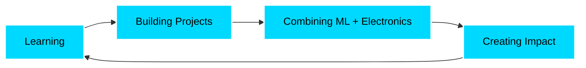

<div align="center">
  
# 👋 Hey there! I'm Aditya Prasad Misra

### 🚀 B.Tech Student | 💻 Full-Stack Developer | 🤖 ML Enthusiast | ⚡ Electronics Explorer


</div>

---

## 🌟 About Me

```python
class AdityaPrasadMisra:
    def __init__(self):
        self.role = "B.Tech 2nd Year Student"
        self.interests = ["Machine Learning", "Software Development", "Electronics"]
        self.current_focus = "Building innovative projects at the intersection of hardware & AI"
        self.competitive_programming = "400+ problems solved 🎯"
        
    def get_skills(self):
        return {
            "languages": ["C", "C++", "Python", "JavaScript", "HTML", "CSS", "Verilog"],
            "frameworks": ["Flask", "FastAPI", "PyTorch", "React", "Tailwind CSS"],
            "hardware": ["ESP32", "Xilinx", "Embedded Systems"],
            "tools": ["Git", "GitHub", "Linux", "Postman", "VS Code"]
        }
    
    def say_hi(self):
        print("Thanks for dropping by! Let's build something amazing together 🚀")

me = AdityaPrasadMisra()
me.say_hi()
```

---

## 🛠️ Tech Stack

<div align="center">

### Languages


### Frameworks & Libraries


### Hardware & Electronics


### Tools & Platforms


</div>

---

## 📊 GitHub Stats

<div align="center">
  


</div>

<div align="center">
  


</div>

---

## 🏆 Competitive Programming

<div align="center">

### 💪 400+ Problems Solved Across Platforms

[](https://leetcode.com/u/Aditya_Prasad_Misra21/)
[](https://codeforces.com)


</div>

---

## 🎯 Current Focus

<div align="center">



🔭 Exploring the intersection of **AI**, **IoT**, and **Web Development**  
🌱 Currently deepening my knowledge in **Machine Learning** and **Embedded Systems**  
💡 Open to collaborate on innovative projects and open-source contributions  
🎓 Dual degree(B.tech + M.tech) 2nd Year | Electronics and communication engineering & specialization in VLSI
   BS in Electronics systems

</div>

---

## 📫 Let's Connect!

<div align="center">

[](https://www.linkedin.com/in/aditya-misra-b2578b317/)
[](https://leetcode.com/u/Aditya_Prasad_Misra21/)
[](mailto:prasadaditya2111@gmail.com)
[](https://github.com/adityaprasadmisra)

</div>

---

<div align="center">
  
### 💭 Random Dev Quote


### 👀 Profile Views


---

**⭐ From [adityaprasadmisra](https://github.com/adityaprasadmisra) | Built with 💙 and lots of ☕**

</div>
